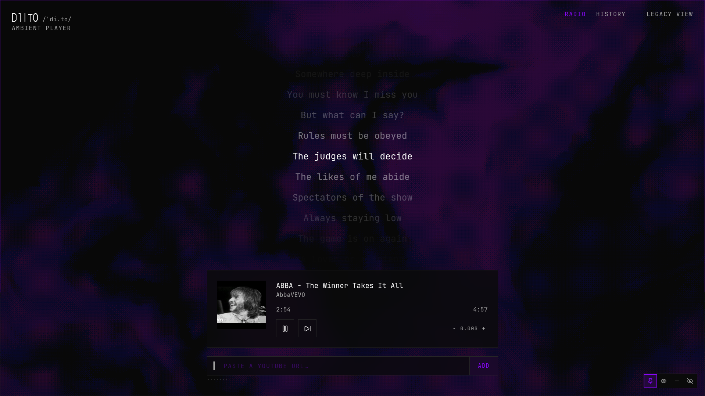
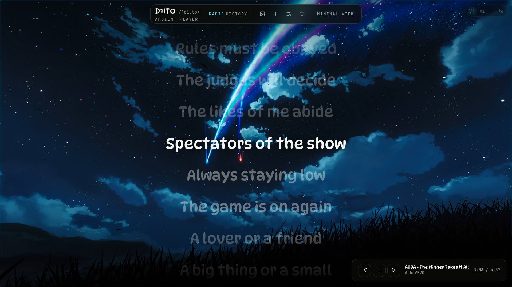

<div align="center">

# DYTOP

**An ambient YouTube player with synced lyrics.**
No account. No server. No tracking.

[](https://buymeacoffee.com/d1ito)

[](LICENSE)
[](https://react.dev)
[](https://www.typescriptlang.org)
[](https://vitejs.dev)
[](https://tailwindcss.com)
[](#docker)
[](public/manifest.webmanifest)

</div>

---

## About DYTOP

DYTOP turns a pasted YouTube link into an ambient listening session: a queue,
a history, and lyrics that scroll in time with the track. There is no backend
behind any of it, only public, keyless APIs, so there is nothing to sign up
for and nothing of yours to store on a server.

The app ships as **two views over one playback engine**:

- **minimal** (`/`, `/history`) - a dark, monospaced interface with an
  animated dither backdrop, in the visual language of the
  [D1ITO](https://d1ito.dev) portfolio. Lyrics fade in and out on an opacity
  ladder around the current line.
- **legacy** (`/legacy`, `/legacy/history`) - the original single-file
  prototype's look: your own uploaded backgrounds, an accent colour sampled
  live from whatever image or video is showing, and a thin progress ring
  traced around the edge of the window.

Switching between them is instant and keeps playback running: the YouTube
embed never remounts, no matter which view or route it's behind.

> **1.1.0.** The player, both views, lyrics sync and background uploads are
> all done and stable. Found something broken?
> [Open an issue](https://github.com/raamonsiu/dytop/issues/new).

---

## Mockups

<div align="center">
  
  
</div>

## Features

### Playback

- **Paste a URL, get a track** - `watch`, `youtu.be`, `/shorts/` and `/embed/`
  links are all recognised. No search box: search needs an API key, and a
  static SPA has nowhere safe to keep one.
- **Metadata without a backend** - title, channel and thumbnail come from
  YouTube's public oEmbed endpoint; no Data API, no quota, no key.
- **A real queue** - history, now playing and upcoming, with drag-to-reorder,
  jump-to-track, and a saved session restored (but not auto-played) on the
  next visit.
- **Playlists** - paste a playlist page's own URL (not just a video that
  happens to be in one) to queue every track it holds, up to 100 at a time.
  Resolved with no API key: a throwaway, invisible player cues the playlist
  and reads its track ids back, then tears itself down.
- **What's next** - a one-line hint under the transport showing the next
  track's title and artist, so the queue doesn't have to be opened just to
  check.
- **Scrubbable progress** everywhere: a slider in both views plus a
  perimeter ring in legacy, all keyboard-accessible.

### Lyrics

- **Synced lyrics from [lrclib](https://lrclib.net)**, a free, keyless,
  community-run database. Falls back to plain, unsynced text, or quietly
  says there's nothing to show, since most pasted tracks have no lyrics at
  all.
- **A sync offset control** to nudge lyrics forward or backward in fractions
  of a second, for the uploads whose intro throws the timing off.

### Backgrounds (legacy view)

- **Upload your own images or videos**, stored locally in IndexedDB, never
  uploaded anywhere.
- **A dynamic accent colour** sampled live from whatever background is on
  screen, driving buttons, focus rings and the progress ring.
- **Fixed, random or on-song-change rotation** between your uploads.

### Interface

- **Three languages** - English, Spanish and Catalan, picked up from the
  browser and switchable at any time.
- **Four visibility states** for the chrome - pinned, auto-hide, ring-only or
  fully hidden - so the interface can get out of the way entirely.
- **A custom zoom** that scales the whole UI independently of the browser,
  with its own bounds tuned for the small mono labels this interface is built
  on. Off entirely on touch devices, which have no gesture to intercept it
  with and no use for it.
- **Responsive down to a phone.** The floating corner widgets (visibility
  control, legacy's mini-player) become full-width stacked rows below 640px,
  every control grows to a real touch target, and the navbar wraps instead of
  overflowing.
- **Installable.** A web app manifest and a set of icons mean "Add to Home
  Screen" gives DYTOP its own launcher icon and a browser-chrome-free window.
- **Reduced-motion support**, following the system accessibility setting.

---

## Getting started

Requires [Node.js](https://nodejs.org) 22+ and
[pnpm](https://pnpm.io) (pinned via Corepack, see `packageManager` in
`package.json`).

```bash
pnpm install
pnpm dev          # http://localhost:5173
```

### Development commands

```bash
pnpm typecheck    # tsc --noEmit
pnpm lint         # eslint .
pnpm test         # vitest run
pnpm build        # typecheck + production build
```

## Docker

```bash
docker compose up --build     # http://localhost:8080
```

The image is multi-stage: dependencies and the production build happen in
Node, but the image that actually runs is `nginx:alpine` serving the static
output. There is no Node process, and no application server, at runtime.
Security headers and a CSP scoped to exactly what the app needs (YouTube,
lrclib, oEmbed) live in `docker/security-headers.conf`.

---

## Project structure

```
src/
  themes/       design tokens shared by both views
  player/       YouTube engine, rAF clock, queue, controller
  lyrics/       LRC parser, lrclib client, sync state
  backgrounds/  IndexedDB storage, accent sampling, rotation
  views/        minimal/ and legacy/
  lib/          pure utilities and hooks
docs/
  prototype.html   the original single-file prototype, kept verbatim
  PARITY.md        what was kept, what improved, and what diverged on purpose
```

### Worth knowing before you touch anything

- **The iframe can't be moved.** It lives in `PlayerHost`, mounted by
  `RootLayout` outside the `<Outlet/>`. Reparenting it in the DOM reloads it,
  and `YT.Player` *replaces* whatever element it's handed, which is why it's
  given a node created imperatively rather than one React renders.
- **Playback time never enters React state.** `player/clock.ts` extrapolates
  between 300ms polls and hands values to subscribers that write straight to
  the DOM. Putting it in state would re-render the tree ~60 times a second.
- **The accent is scoped per view.** `globals.css` derives `--accent` from
  `--accent-override` on `[data-view]`. Legacy's dynamic accent is written to
  its own shell node; on `:root` it would leak into minimal on client-side
  navigation.
- **Only minimal loads `three`.** The Dither component sits behind
  `React.lazy`, in its own chunk, heavier than the rest of the app combined.
- **Two different signals decide what "mobile" means.** `pointer: coarse`
  (`useZoomControl`) answers "is this touch," and turns the custom zoom off.
  A `max-width` media query (`useIsCompactLayout`) answers "is there room,"
  and switches the corner widgets to full-width rows. A narrow desktop window
  should get the second without the first, so they're kept as two hooks
  rather than one.

---

## Contributing

Pull requests are welcome.

- `pnpm typecheck`, `pnpm lint` and `pnpm test` must pass before you open a PR.
- Match the conventions already in the code: JSDoc where it earns its place,
  descriptive names over comments, no dead code.
- Keep PRs small enough to review in one sitting.

**Found a bug?**
[Open an issue](https://github.com/raamonsiu/dytop/issues/new) with what you
did, what you expected, and what happened instead.

---

## Privacy

**DYTOP has no backend.** There is no account, no analytics, no crash
reporting and no telemetry of any kind. What the app stores, it stores on
your device.

| Data | Where it lives | Leaves the device? |
|---|---|---|
| Queue, history, preferences | `localStorage` / IndexedDB | Never |
| Uploaded background images and videos | IndexedDB, as blobs | Never |
| Track title and artist guess | Sent to lrclib.net | Only to look up lyrics for that track |
| Video ID | Sent to YouTube's oEmbed endpoint and IFrame API | Only to fetch metadata and play the video |
| Playlist ID | Sent to YouTube's IFrame API | Only to resolve a pasted playlist to its tracks |

Nothing else reaches the network. There is no first-party server for any of
this to go through in the first place.

---

## License

DYTOP is released under the [MIT License](LICENSE).

In short: you may use, copy, modify and redistribute this code, including
commercially, as long as the copyright notice and the licence text travel
with it. It comes with no warranty of any kind.

---

<div align="center">

Made with love by **D1ITO**

[](https://github.com/raamonsiu)
[](https://buymeacoffee.com/d1ito)

</div>
